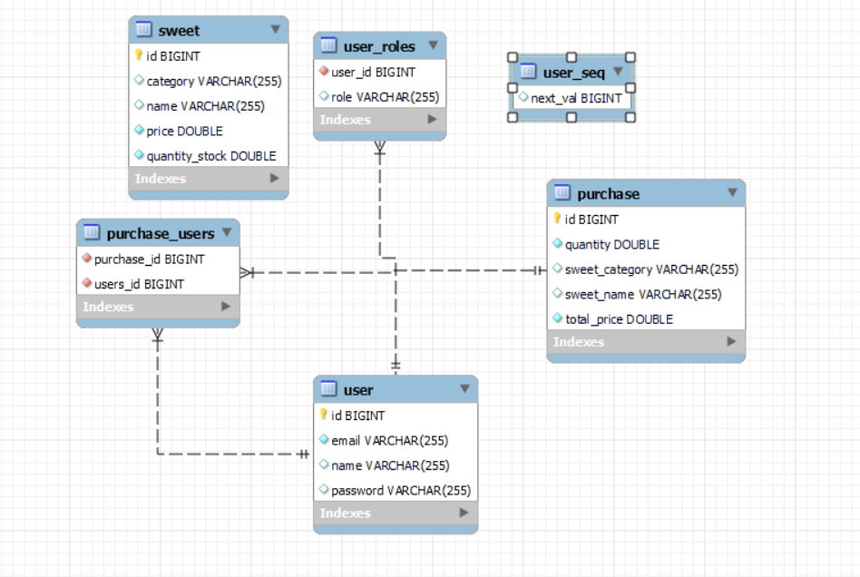
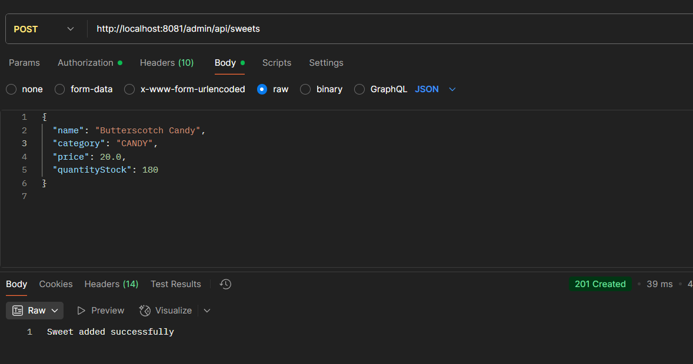
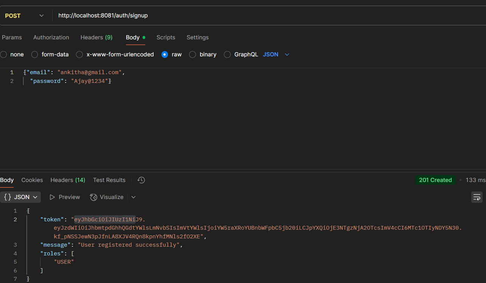
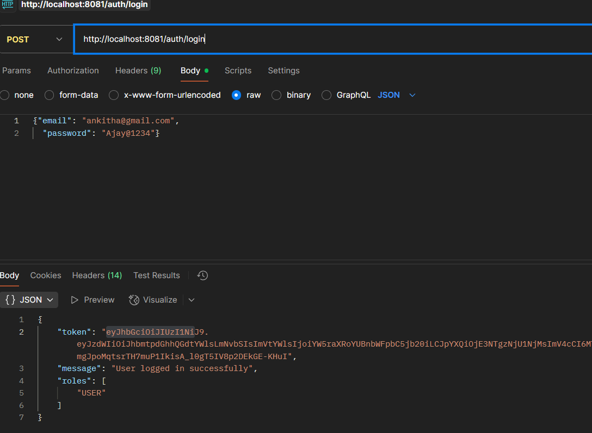
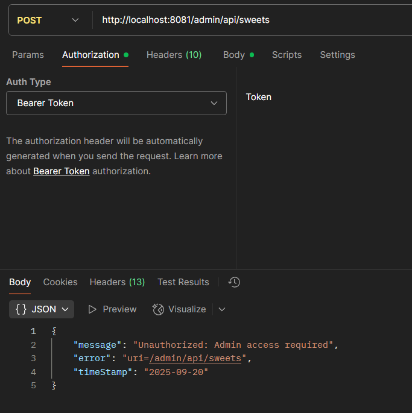
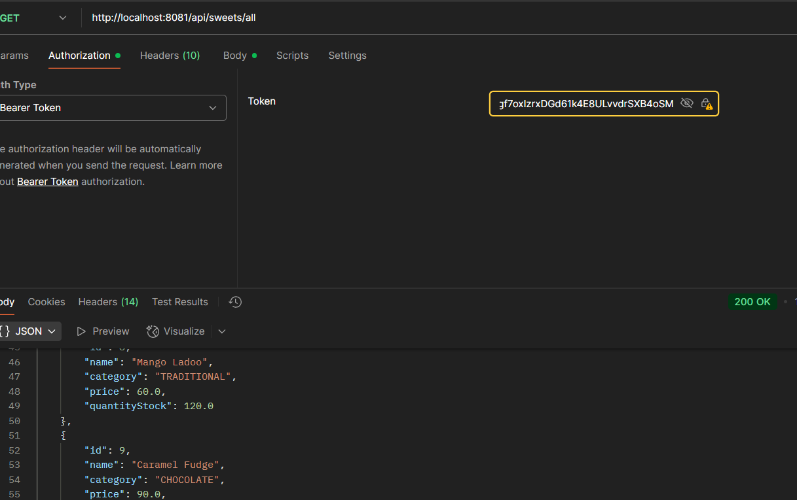
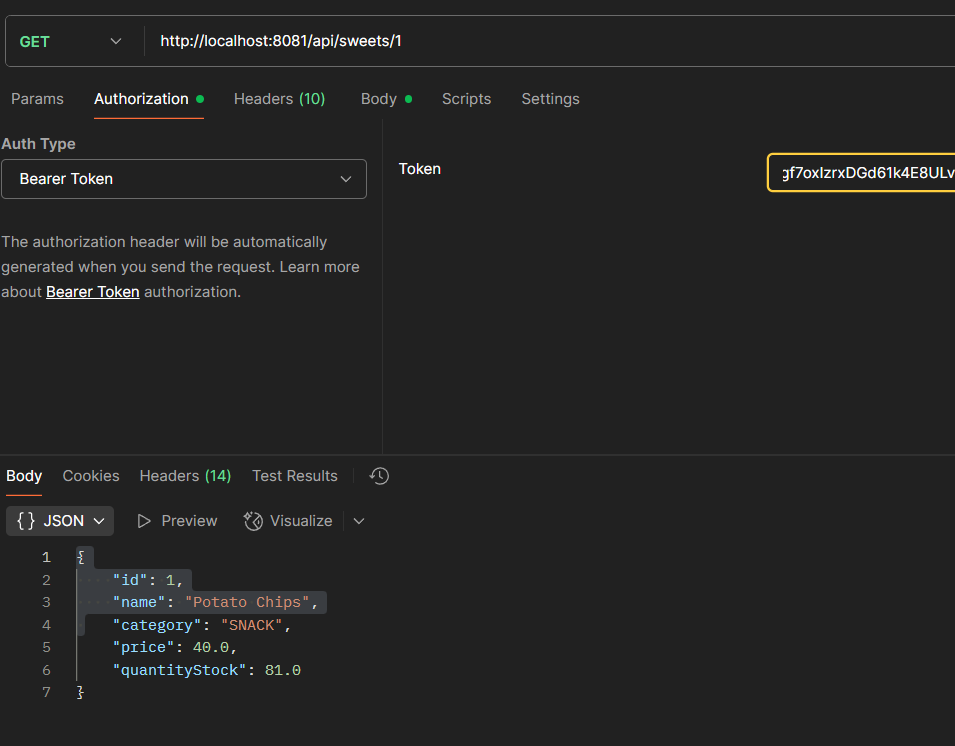
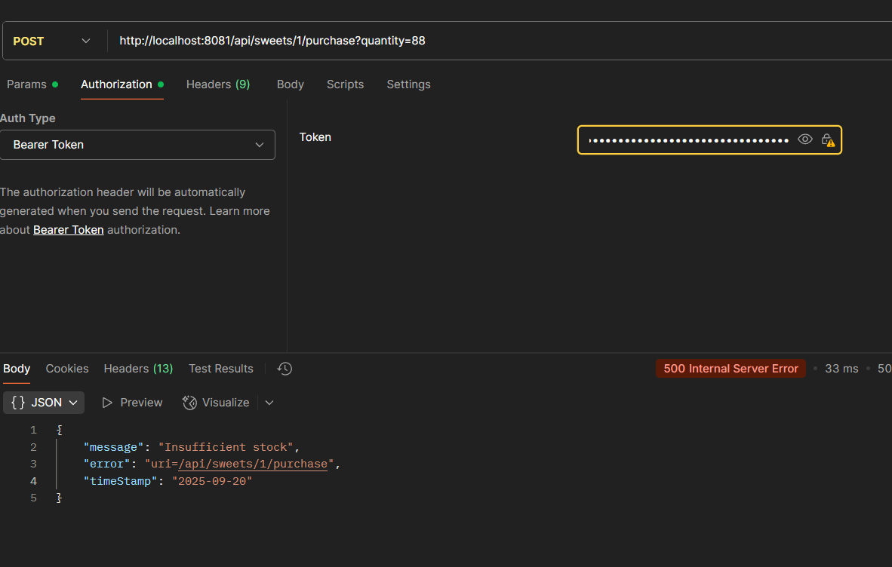
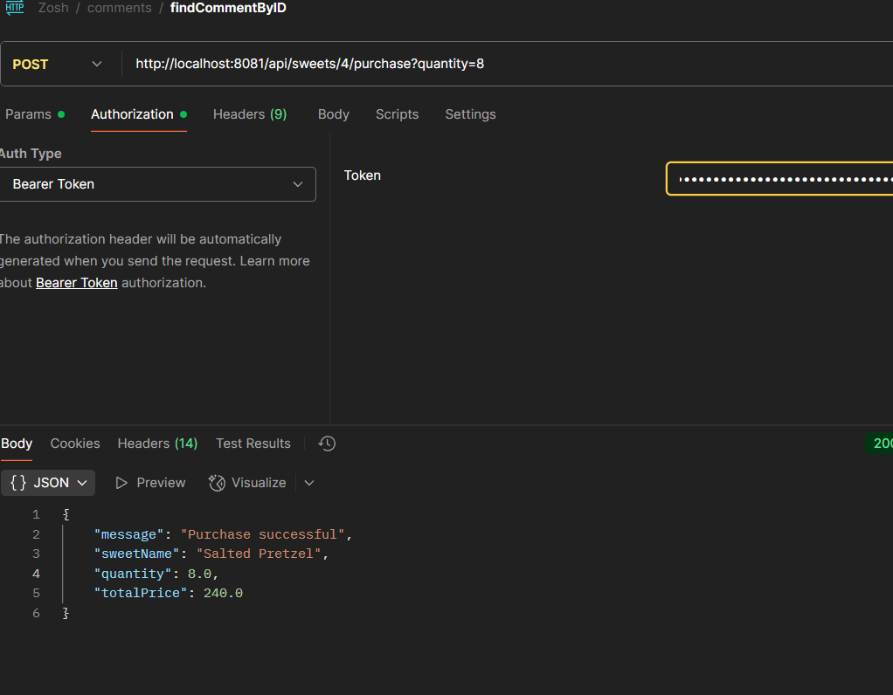

# sweetManagementSystem

## API Endpoints

### Authentication

#### POST `/auth/signup`

- **Payload:**
  ```json
  {
    "name": "string",
    "email": "string",
    "password": "string"
  }
  ```
- **Response:**
  ```json
  {
    "token": "jwt-token-string",
    "message": "User registered successfully",
    "roles": ["USER"]
  }
  ```

#### POST `/auth/login`

- **Payload:**
  ```json
  {
    "email": "string",
    "password": "string"
  }
  ```
- **Response:**
  ```json
  {
    "token": "jwt-token-string",
    "message": "User logged in successfully",
    "roles": ["USER" or "ADMIN"]
  }
  ```

---

## User Endpoints

> All user endpoints require `Authorization: Bearer <token>` header.

#### GET `/api/sweets/all`

- **Response:**
  ```json
  [
    {
      "id": 1,
      "name": "Rasgulla",
      "category": "Bengali",
      "price": 100.0,
      "quantityStock": 50.0
    }
    // ...more sweets
  ]
  ```

#### GET `/api/sweets/{id}`

- **Response:**
  ```json
  {
    "id": 1,
    "name": "Rasgulla",
    "category": "Bengali",
    "price": 100.0,
    "quantityStock": 50.0
  }
  ```

#### GET `/api/sweets/search?name=...&category=...&minPrice=...&maxPrice=...`

- **Response:** Same as `/api/sweets/all` (filtered).

#### POST `/api/sweets/{id}/purchase?quantity=2`

- **Payload:** _none (quantity in query param)_
- **Response:**
  ```json
  {
    "message": "Purchase successful",
    "sweetName": "Rasgulla",
    "quantity": 2,
    "totalPrice": 200.0
  }
  ```

---

## Admin Endpoints

> All admin endpoints require `Authorization: Bearer <token>` header and `ADMIN` role.

#### POST `/admin/api/sweets`

- **Payload:**
  ```json
  {
    "name": "string",
    "category": "string",
    "price": 100.0,
    "quantityStock": 50.0
  }
  ```
- **Response:**
  ```
  Sweet added successfully
  ```

#### PUT `/admin/api/sweets/{id}`

- **Payload:** Same as above.
- **Response:**
  ```json
  {
    "id": 1,
    "name": "string",
    "category": "string",
    "price": 100.0,
    "quantityStock": 50.0
  }
  ```

#### DELETE `/admin/api/sweets/{id}`

- **Response:**
  ```
  Sweet deleted successfully
  ```

---

## Notes

- All APIs have been tested using Postman for both valid and invalid scenarios.
- JWT token-based authentication is implemented for all protected endpoints. You must include the `Authorization: Bearer <token>` header for user and admin APIs.
- Proper error handling is implemented for cases such as invalid credentials, unauthorized access, missing fields, and resource not found. The API returns meaningful error messages and appropriate HTTP status codes for all error cases.
- The initial frontend setup and component structure were generated using AI assistance for rapid prototyping. Components and UI were then customized and modified as per project requirements and feedback.
- The backend (API, business logic, and all server-side code) was developed entirely by hand without AI assistance. All logic, endpoints, and error handling were written and tested manually.

DB Schema -> SweetsDb


Create Sweet


Signup


Login


Admin routes are secured


Get All Sweets


Get By Id


Purchase Insufficient Stock


Valid Purchase

